## November 12th, 2019

Choices I’ve considered for Savitar’s Text Engine:

* NSTextView
* WKWebView
* iTerm2Lib

I started down the path of using NSTextView until I got to the point where I wanted to start rendering ANSI codes and also thought about how things like `<code>` would need to be implemented. I wanted both of course. So, If I used NSTextView, I’d have to do an ANSI-to-attributedString parser as well as an HTML-to-attributedString parser. I found an ANSI-to-HTML parser (`aha.c`). This got me thinking of using WKWebView, because it could handle the HTML natively and aha.c would provide the ANSI code support. Also, it gave room to doing other media types easily, including links of course.

I then thought WKWebView would be just too darn slow. So, I set my sights on iTerm2Lib, for it was performant, could handle ANSI codes, and well, I could live without HTML… I guess.

The problem with iTerm2Lib is I’m carving it up into smaller pieces, and the network aspect isn’t going to be a joy to deal with.

What if WKWebView was in fact performant? Wouldn’t that be the ideal means to render text for the next generation of Savitar? WKWebView claims to be: “Boasting responsive 60fps scrolling, built-in gestures, streamlined communication between app and webpage, and the same JavaScript engine as Safari”.

Hey, JavaScript would be a nice addition too. I think I’m back to exploring WKWebView.

## November 13th, 2019

Next thing I want to do is do some local testing, get some ANSI-to-HTML conversion working.

## November 29th, 2019

I moved over to using WkWebView for output and am successfully processing ANSI escape codes using a hacked-up aha.c. The Appearance settings tab is fully operational, allowing the setting of background and foreground colors, as well as body and code fonts and sizes, all through <head> CSS style. This has proven to be a great success for me! I’m unblocked from pondering how to display output and can now focus on the meat of the application.

## November 30th, 2019

I got IAC telnet command parsing working. The next task is to add some internal logging support and then onto triggers.

## December 10th, 2019

I started a laundry list to get into start of beta:

```
√ STARTED A PRIVATE GITHUB REPO
√ APP IS 64BIT ONLY, RUNS ON CATALINA
√ APP IS INTEGRATED WITH APPCENTER, HANDLES CRASH REPORTING AND BASIC ANALYTICS
√ READING SAV 1.X WORLD SETTINGS, OPENING SESSIONS
√ INTEGRATED WKWEBVIEW AS THE OUTPUT PANE
√ WORLD SETTINGS APPEARANCE TAB IS OPERATIONAL
√ OUTPUT TRIGGERS ARE WORKING
_ LOAD SAV 1.X APP SETTINGS (INCLUDES TRIGGERS)
_ LOAD SAV 1.X WORLD TRIGGERS
_ INPUT PANE COMMAND RECALL AND LOCAL COMMANDS SUPPORTED
_ TRIGGERS WINDOW IMPLEMENTED
_ IMPLEMENT WORLD SETTINGS STARTING TAB
_ CONNECT/DISCONNECT SESSION HANDLING
_ IMPLEMENT REMAINING WORLD SETTINGS TABS
_ LOGGING
_ ADD CHECK FOR UPDATES SUPPORT (SPARKLE?)
_ ADD BUG REPORTING SUPPORT
_ ENHANCED ANALYTICS
```

### START OF BETA

```
_ MOVE GITHUB REPO TO PUBLIC
_ RELEASE ALPHA TO SELECT TESTERS, START GETTING FEEDBACK
_ REWRITE AHA
_ ANSI COLOR SETTINGS WINDOW IMPLEMENTED
_ INPUT TRIGGERS (? DOES ANYONE USE THESE?)
_ MACRO CLICKER
_ MCP (? DOES ANYONE USE THIS?)
_ AUDIO & SPEECH
_ FILE UPLOAD
_ POLISH

```

### POST FIRST RELEASE

THESE FEATURES TAKE SAVITAR 2.0 BEYOND WHAT 1.6.X PROVIDES:

_ SSL SUPPORT
_ JAVASCRIPT ?
_ ???


## January 4th, 2020

Happy New Year.

The most current laundry list:

### START OF ALPHA

```
√ STARTED A PRIVATE GITHUB REPO
√ APP IS 64BIT ONLY, RUNS ON MACOS 10.12 AND LATER, INCLUDING CATALINA
√ APP IS INTEGRATED WITH APPCENTER, HANDLES CRASH REPORTING AND BASIC ANALYTICS
√ READING SAV 1.X WORLD SETTINGS, OPENING SESSIONS
√ INTEGRATED WKWEBVIEW AS THE OUTPUT PANE
√ WORLD SETTINGS APPEARANCE TAB IS OPERATIONAL
√ OUTPUT TRIGGERS ARE WORKING
√ LOAD SAV 1.X APP SETTINGS (INCLUDES TRIGGERS)
√ LOAD SAV 1.X WORLD TRIGGERS
_ INPUT PANE COMMAND RECALL AND LOCAL COMMANDS SUPPORTED
_ IMPLEMENT INPUT TRIGGERS
_ IMPLEMENT TRIGGERS WINDOW
_ IMPLEMENT WORLD SETTINGS STARTING TAB
_ CONNECT/DISCONNECT SESSION HANDLING
_ IMPLEMENT REMAINING WORLD SETTINGS TABS
_ MENUBAR FINALIZED
_ LOGGING
_ ADD CHECK FOR UPDATES SUPPORT (SPARKLE?)
_ ADD BUG REPORTING SUPPORT
```

### START OF BETA

```
_ MOVE GITHUB REPO TO PUBLIC
_ RELEASE ALPHA TO SELECT TESTERS, START GETING FEEDBACK
_ REWRITE AHA
_ ENHANCED ANALYTICS
_ ANSI COLOR SETTINGS WINDOW IMPLEMENTED
_ MACRO CLICKER
_ MCP (? DOES ANYONE USE THIS?)
_ AUDIO & SPEECH
_ FILE UPLOAD
_ POLISH
```

### POST FIRST RELEASE

THESE FEATURES TAKE SAVITAR 2.0 BEYOND WHAT 1.6.X PROVIDES:

```
_ SSL SUPPORT
_ DARK MODE SUPPORT
_ JAVASCRIPT SCRIPTING?
_ ???
```

## January 11th, 2020

I wrote the following in PR #6 this morning: “Wrapping up this current work. Going to explore using Core Data instead of SavitarManager and NSCopyable. That'll clean-up the code and allow more idiomatic use of Swift, as well as open the door to possible SwiftUI work too.”

Then I thought about it and determined rewriting into Core Data is outside the scope of the initial release of Savitar 2.0.

## January 12th, 2020

I’m on my way into the Events Window now, modifying a world’s triggers for the first time (editing trigger names and enabled/disabled right now). This brings up the question of “How does NSDocument get marked dirty?” Well, it’s tied into the Undo Manager. I suppose it would be fantastic to support undo for world trigger edits. Which is a separate thing from modifying universal triggers.

I guess I need to do a full study of the NSDocument…

First thing: NSUndoManager is fairly straightforward to deal with. However, it’ll require associating editable things, like a world’s triggers, to the world’s document’s undo manager. This can be done via the SavitarManager (TriggerManager).

The problem with the Events Window is that there are multiple UndoManagers involved. Each open world has its document’s undo manager, and then the universal triggers/variables have the app-wide undo manager. Simply registering undo with each triggerman’s document undomanager isn’t enough, because the menu item won’t change when the Events Window is in the foreground, it only appears when the document is in the foreground. windowWillReturnUndoManager apparently will help with this. Alternatively, I’d have to tie the triggers/variables right to the document window, like how settings works. If I went this route, I would not have to deal with doing an NSOutlineView-based Events Window. Simplifying the work, giving up drag and drop for closer association to the world, but also on the flip side, giving up UI parity with Savitar1’s Event Window. Another downside of settings sheet-based triggers/variables is you can’t test them as easily, you’d have to keep dismissing the entire sheet to get back to text input (the sheet is modal).

The bottom line is: the world’s document needs to go dirty when a trigger is enabled/disabled or edited. Having undo/redo is gravy on top of that and comes almost for free if done the right way.

## January 16th, 2020

Next Savitar challenge:

When a World’s title changes, the change must propagate to the trigger manager and var manager, which in turn will signal a change to any open Event Window.

One way to simplify things is to remove the name attribute off of SavitarManager (triggerman and varMan) and instead have Event Manager enumerate open worlds as needed.

Also noted: A world’s document window is listing its file name, not its world name. That is actually a good thing, makes it easy to find the document. Perhaps one doesn’t rename a world in settings at all, just use the filename to refer to it.

So, I removed the ‘name’ field from Savitar Manager and instead taught the Event Window how to name trigger managers by world or universally (app wide).

January 20th, 2020

I decided over the weekend to use a Flux design pattern for Savitar2’s data model. It’ll be implemented using ReSwift.

Things that go into the Store:

```
World Document
	Actions: add_world, remove_world
	Listeners: Event Window
```

So, good. Event Window knows to update automatically its groups. But, what happens when a world’s trigger is edited at the document? How does Event Window listen for that?

```
Trigger
	Actions: add_trigger, remove_trigger, enable_trigger, disable_trigger
```
Those are the easiest actions... then there are:

```
	Rename_trigger, change_trigger, etc.
```
Rename and change should be the same, I think. The granularity is at the trigger as a whole.

So, along with observing a world document, should Event Windows observe a world’s triggers individually? And if so, then how does the trigger equate back to its trigger man? Or… is a Trigger Man even necessary any longer? Surely one is needed to preserve order of triggers, meaning we need a “move_trigger” action. May as well have “add_trigger” and “remove_trigger” be peers to “move_trigger” then.

These are considerations general to Flux/Redux. Probably every TODO app ever made has this problem to solve (add, remove, move, change TODOs).

A google search for redux+add+remove+objects+change reveals… 

["Redux Patterns: Add/Edit/Remove Objects in an Array”](https://hackernoon.com/redux-patterns-add-edit-remove-objects-in-an-array-6ee70cab2456) -- covers using a `byId` and `byHash` approach and is made reference to as a best practice here: https://www.reddit.com/r/reactjs/comments/6o9tfq/redux_patterns_addeditremove_objects_in_an_array/

[“Immutable Update Patterns”](https://redux.js.org/recipes/structuring-reducers/immutable-update-patterns/) -- covers handling immutablity of arrays. Copying of nested objects.

[“Immutability in React and Redux: The Complete Guide”](https://daveceddia.com/react-redux-immutability-guide/) -- general reading

[“Why you should use an object, and not an array, for lists in Redux”](https://medium.com/javascript-in-plain-english/https-medium-com-javascript-in-plain-english-why-you-should-use-an-object-not-an-array-for-lists-bee4a1fbc8bd) -- this is a worthwhile technic, however, triggers have an ordering requirement. Perhaps I can marry this article up with the “Redux Patterns: Add/Edit/Remove Objects in an Array” article of keeping a `byId` array.

If we go this way, then every trigger needs to have a unique id.

Bonus: Savitar1 used trigger names as the unique identifier. Savitar2 can use internal (not displayed to the user) unique ids, which then allows for triggers of the same “name” (a trigger’s “name” is a misnomer – it’s really the text matching string.)

NSOrderedSet gives us the best of both worlds. Fast lookup and ordering.

Need to explore how adding/moving items in the NSOrderedSet is done. Do I employ NSMutableOrderedSet? Likely – there is the wonders of `moveObjects()`.

```
ACTION: move_trigger(oldIndex: Int, newIndex: Int)
new_state = NSMutableOrderedSet(state)
new_state.moveObjects…)
return NSOrderedSet(new_state)

ACTION: remove_trigger(id)
new_state = NSMutableOrderedSet(state)
new_state.remove(id)
return NSOrderedSet(new_state)	
```

Is it necessary to have a trigger man if all interactions with triggers are done thru actions? Is the trigger man basically the ordered set being operated on?

I think so, unless of course we want to wrap the actions with methods off of trigger man. Not sure what that gains us. Let’s look at what ReSwift action calls look like.

Read this code next: [https://github.com/ReSwift/ReSwift-Todo-Example/blob/master/ReSwift-Todo/ToDoListActions.swift](https://github.com/ReSwift/ReSwift-Todo-Example/blob/master/ReSwift-Todo/ToDoListActions.swift)

## January 23rd, 2020

Maybe I should write a simple stand-alone app that demonstrates the management of triggers. But, why? Mainly because current triggers are classes whereas ReSwift and modern Idiomatic Swift prefers structs. They are objects because: @obj dynamic name field.

We’re using @obj dynamic on the controllers, they need not be on the object itself.

I’d like to start the data model over, but before I do, I’d like to get a working knowledge of ReSwift under my belt.

What would the sample app do?

It would allow the opening of multiple documents. In each document, an ordered array of employees is presented, representing a “job site”:

```swift
	struct employee {
		name: String
		skills: String
	}
```

There would be a add button on each document. Removal is done by highlighting the employee and hitting the delete key.

There would be an “All Employees” window that lists all the documents by group and allow add/removal, and most importantly MOVE of employees.

## February 3rd, 2020

Start of new internal repo, ReSwift example. [https://github.com/jkoutavas/reswift-example](https://github.com/jkoutavas/reswift-example)

Each document will contain a list of employees for a job. (Job) 

## March 29th, 2020

Example is complete.

## April 2nd, 2020

Data modeling Savitar2 using ReSwift

Overall app state should contain:

	The global triggers
	And the triggers for each open world document

Let’s start by modeling preferences

## April 9th, 2020

Well, let’s DO SOMETHING!

Getting caught back up. Reviewing this Jan 16th entry:

*Also noted: A world’s document window is listing its file name, not its world name. That is actually a good thing, makes it easy to find the document. Perhaps one doesn’t rename a world in settings at all, just use the filename to refer to it.*

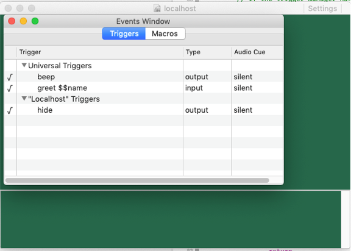

What exactly does Savitar 1.6 do?

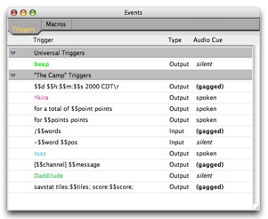

It renames the title of the window when the world is renamed.

Yeah, it seems real to me that the world name isn’t editable, nor needs to be displayed.

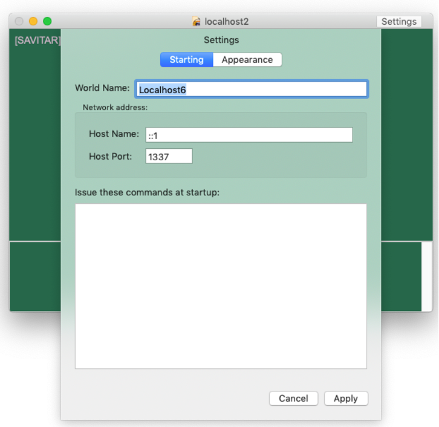

Current Savitar 1.6’s Events Window handles documents coming and going fine. Whereas the latest build of Savitar2 does not. Has no observation for this change.

Maybe a nice next baby step is to add an “employee” summary/assignment window to my ReSwift example. So that one may see a summary of all job documents. Can drag and drop from within the same table just as one would do with drag and drop between job documents.

There would still be a per-document jobStore. But now, there’s an app-wide employeeStore where all employees in open jobs are added and removed from. The employeeStore is an array of documents? Or Jobs? Hmm.. problem. It’s easy to see how jobs would get added/removed from the employeeStore, but this means that all the employees are getting duplicated. First in the document’s jobStore, and then in the employeeStore. Employees have unique IDs.. maybe the employeeStore has just employeeIDs?

What if there simply wasn’t an Events Window at all? Instead, there’s an events table on each world document, and a global events window.

I mean, really. How important is it (or common) to drag events from one world to the next?

Is the goal simply feature parity with Savitar 1.6? – YES

So, f*ck it. Implement the Events Window already.

What if there was just one store? When the world document opens, it registers its contents in The One Store. There would be no duplication – a single source of truth. A world would not have a trigger manager, it would observe triggers for its entry in The One Store. It adds/removes its entry at open/close via dispatched actions. Is it ‘addTriggers’ or ‘addWorld’?

## April 17th, 2020

Must. Get. Restarted.

Is it right to have a document open, but then have its visual representation be driven from The One Store? I guess so. It just seems a little counter intuitive. But it works.

Success! The beginnings of a globalStore, obsoleting AppContext.preferences.triggerMan with appState.universalTriggers

## April 18th, 2020

Q: When a document opens, what does it add to the globalStore?

A: To start with, its triggers. So that they may be edited. A world document has a GUID. So, we could go with having triggers mapped by world GUID.

```swift
var GUID = NSUUID().uuidString
worldTriggers: Dictionary<GUID, [Trigger]>
```

have to handle the case where a World document is copied, and then is opened along with its original. Perhaps the key needs to be in the format of “{GUID}:{Document-path} so as to avoid this.

EventsWindow needs to know the world’s name, it’s used as the group name. It probably helps to also have all the World in the globalStore, plenty of settings and things needed there. 
I went ahead and added a state.worldDocuments: [Document]. Going this route, will subscribers get notified when something in the document changes? Answer: Nope. I changed the color and no notification went out. Which means the document held in globalState no longer represents state of the document itself.

(there’s this traditional means to get to documents, too: NSDocumentController.shared().documents
)

What to do if 2 worlds with the same UUID are opened?

1.	LOSE THE WORLD NAME. Use the documents filename in the EventsWindow
2.	If filenames are equal then spell out the full path

What good is a UUID at all for a world? Ah! We’re using it for framesize/autosaveName

If a document gets opened and there’s already a document of that GUID, change the newly opened document’s GUID. Ugh, I’m not happy with this. That means world documents mutate on open, can’t be read only.

## April 21st, 2020

A world is identified by its filename in its document title and in group names in the Events Window. If more than one window is open with the same filename, the event window will indicate full paths for them. Tapping on the group name will take you to that document. The Event Window keys its documents off of the full path of the world (not the UUID).

The splitview controller’s autosavename is keyed off of the document’s UUID. If a second world is opened with the same UUID, we handle it as an edge case. (post alpha)

Need to study this NSDocument API:

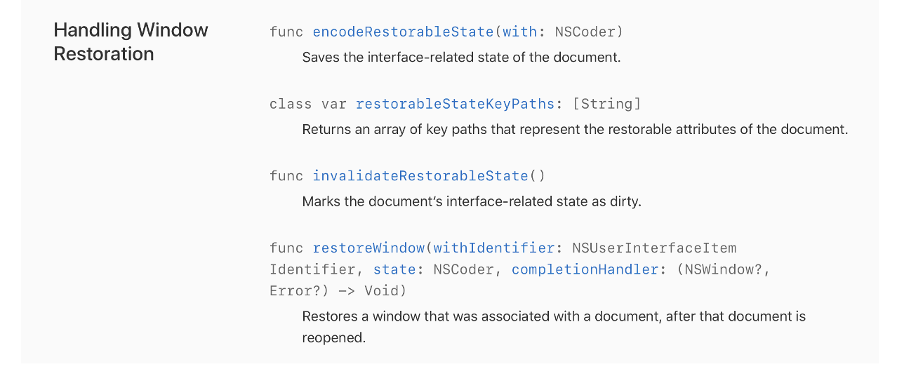

According to documentation here, https://developer.apple.com/documentation/appkit/nsdocument/1526257-encoderestorablestate, we can stash any UI setting we want along with the rest of the document’s state. And this says we can do it for ANY view controller: https://developer.apple.com/documentation/uikit/view_controllers/preserving_your_app_s_ui_across_launches

Thus, I can do away with the GUID entirely, just [set the splitview’s autoSaveName to something](https://developer.apple.com/documentation/appkit/nssplitview/1455319-autosavename).

Okay, EventWindow has been updated. Next on the plate: ditch “world name” from the document entirely.

…well, world name was kind of handy for the World Picker. I’ll need to think about World Name more. Also, just how useful is this now? `RESOLUTION="24x80x2" POSITION="44,0" WINDOWSIZE="480,270" ZOOMED="FALSE"`. It would be kind to read this from v1.0 documents and then setup the window based on it, but there’s no need to write these fields to the v2 document.

The next step for Savitar is to remove TrigMan completely. Just use arrays of Triggers, and undo comes from Middleware. Once there is a working undo middleware, it may be time for the first ReSwift PR.

So. Looking at toggling trigger state. The “item” is a trigger. One action type could look like:
	`toggleTriggerEnabledAction(trigger)` and then let the reducer determine where the trigger is, (universal or document).

That’s kind of yucky, searching for a trigger like that. And, how does the document/endpoint subscribe to this?

Another way:
	`toggleTriggerEnabledAction(trigger.identifier)`
Whereas all triggers are keyed off of the identifier. This avoids the yucky search, but the question remains: how does the document/endpoint subscribe to this?

What if each document had its own store? Then, the action dispatch looks like this:

`trigger.store.dispatch(toggleTriggerEnabled(trigger))`.

Each document has its own undo manager, just like TextEdit has, and so does ReSwift-Todo.

Great. But, the interesting twist here is the Event Window, which has undo-ability across multiple stores.

I suppose IT can have its own store too, and that store delegates change to the individual documents. Hmm. This nicely cleans up the group name/ trigger group setup in EventWindow. globalStore would just maintain a list of openWorldDocuments and universal triggers. Otherwise, the triggers for a document come from subscription to the document’s store.

```
OnEventWindowOpen:
	Subscribe to globalStore.openWorldDocuments

OnStateChange:
	Subscribe to document’s store???
```

Effing event window!!!!!!!! It’s so cross-purpose

EventWindow should not have its own array of triggers, it should just build a view model based on what documents are open.
Why have Event Window? – so we can drag and drop between worlds, but more importantly, seeing the execution order of universal triggers.

If we had an EventWindow per world, then everything is contained within the scope of the document’s store. One can still list the universal triggers in the view, and then changes simply go off to the globalStore for the change. Which in turn, all open document EventWindows would then display the change.

Per Document EventWindow

How do we keep that window associated with the world’s document window? It’s kind of like a “get info” pane. Why not just make it another tab on the world’s settings? (Triggers after all ARE settings). And.. we don’t even have to list the universal triggers at all there. Have the app-wide EventsWindow be JUST the universal triggers!

One thing that is useful about the Savitar 1.6 EventsWindow is that you can make changes there and see them in the world. With the way we’re doing 2.0 Settings, it’s a modal sheet. Would be better if that were not modal. It could be a side-pane, like xcode has. But, that lends the window to being resized, which is not something you want to really do with a terminal window.

Think of it like a browser… we could open BELOW with the settings. No modality. Heavy reliance on Undo. Lots of tabs.

Okay. So, we’re going to drop modality. We’re going to go with per-document stores. We’re going to do ONLY universal triggers from the Events Window. (This means we can move to multi-column NSTableView instead of an NSOutlineTableView)

This is cool. A world document can have a console now. It can have a debugger. It can have… stuff.

Maybe we leave settings be modal, but just have Events / Aliases panel show up below, non-modally. YES.

In any case, having the Settings modal being tied to the world document is a plus in 2.0, it allows at least side-by-side comparisons of worlds, copy and paste too. Maybe users want to ALWAYS have their triggers displayed alongside their world. Could even momentarily highlight them as they trigger!

Triggers/Aliases are LISTS. So, displaying it alongside the main content fits better than underneath. Underneath can become a debug console…

…hmm, what happens when you double-click on a trigger?
On Sav 1.6, it’s a modal over the non-modal EventsWindow.
Maybe we DO put the events/aliases below the window, and there have a side panel, none of which are modal. Like Safari debugger…

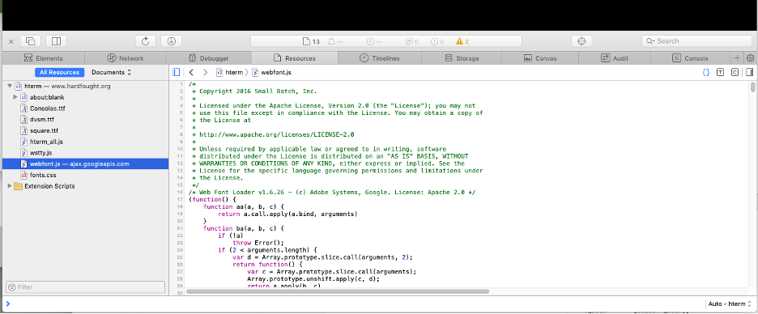

(Chrome, btw, does it alongside the right-side as a default, but the location can be moved to left, bottom, or separated.) We too can do all of these things. Perhaps we start out with a separate EventsWindow, titled “Events – {document title}”

This last thought aligns VERY WELL with what you’ve explored with ReSwift-example.

**LET US START WITH A PER-DOCUMENT EVENTS WINDOW PLUS A UNIVERSAL EVENTS WINDOW, AND LEAVE SETTINGS AS THEY ARE – MODAL.**

Definitely want to add a side-panel to the EventWindow (not a modal dialog pop-up on trigger selection)

## May 6th, 2020

What’s next:

```
√ get selection working
√ populate variables tab
_ get drag and drop re-ordering for triggers working
√ get checkmark on/off going again
√ get trigger enable/disable undo working
√ get variables enable/disable undo working
_ per-world event windows
```

That’ll complete the current “ReSwift” PR I’m working on. I can then move to side detail view of the triggers and macros themselves.

## June 17th, 2020

I really need to have the per-world events window be part of the world’s window, not a separate window. That way, the UndoManager for the document will be active when mucking with the document.

I’ll need to make the per-world event window into a pane on the document, akin to how Pages reveals its Format and Document side pane. Setting should probably go this route too. But man, the events pane will be pretty wide, because it’ll have to embrace both the list and the details.

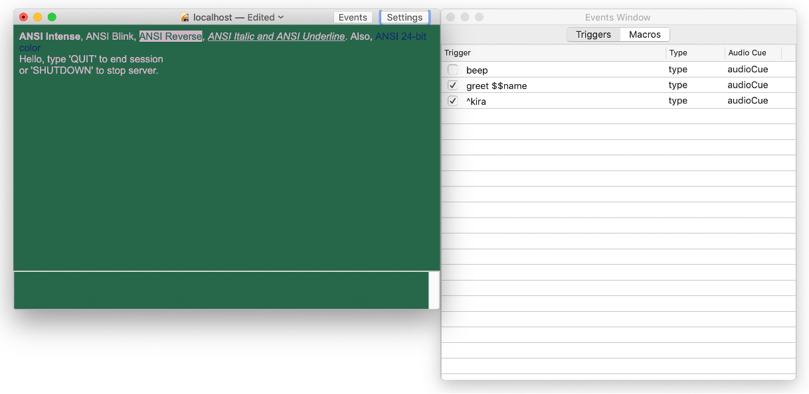

But, you know what? The events window doesn’t need multiple columns if we’re putting details alongside it.

Next PR is to explore the new Events Window layout with details.

## December 7th, 2020

Here’s how that turned out:
 
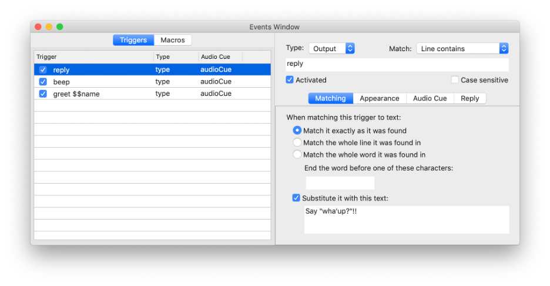

Now it’s time to implement the side panel.

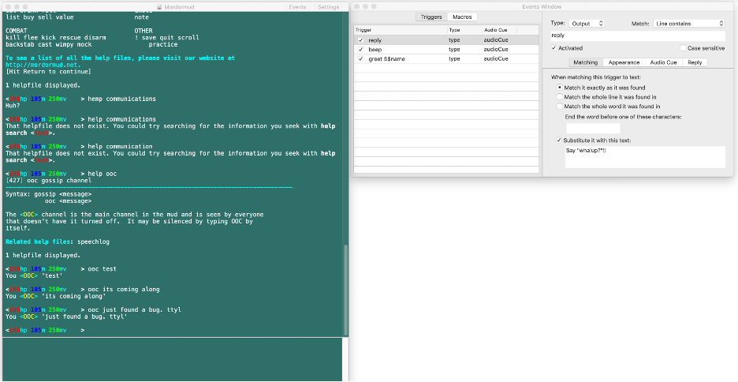

There’s not a good use of the bottom-right quadrant of this layout. There’s nothing gained by having the Events Window made taller, all the detail views are fixed height.

Maybe we always show the world settings…

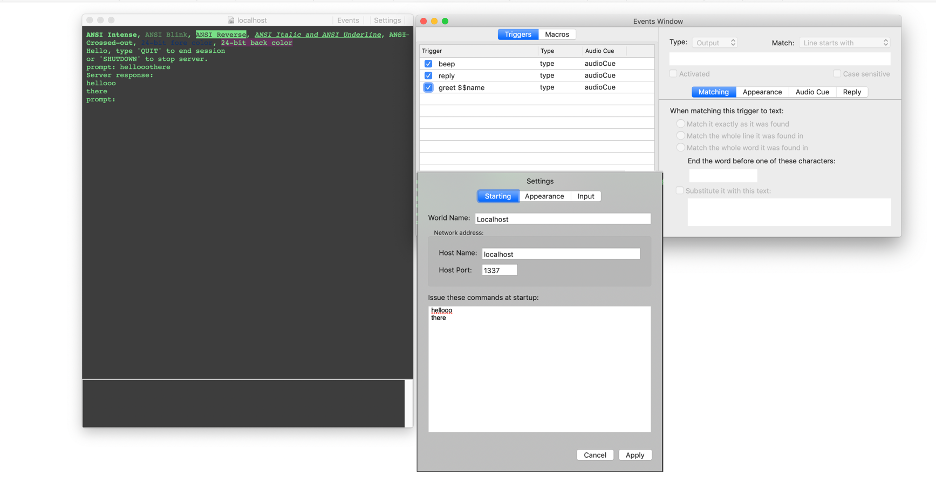
 
Darn it. Settings is too tall.

Maybe there can be a debug console in the lower right quadrant.

Or.. vertically stack the events views?

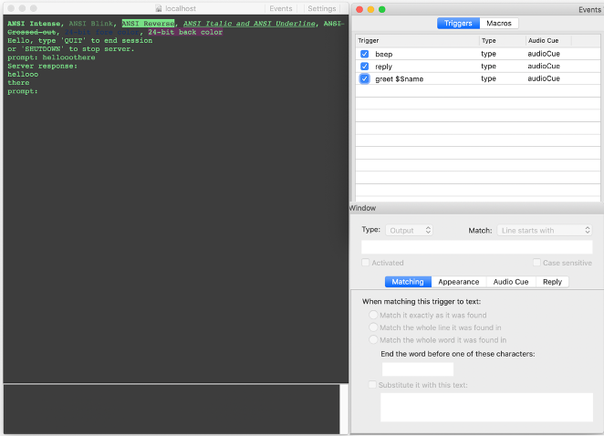 

That seems clumsy.

Instead of it being a panel, it could be its own window, magnetically locked to the world’s window.

Our next step on this journey is have the window come up. Not attached in any way, and make sure per-world triggers/macros properly interact with the universal ones (precedence, drag-n-drop.)

## Dec 12th, 2020

That turned out well. Now it’s time for getting a smooth New world creation flow.

Savitar 1, when picking the New File menu item, brought-up the World Picker:

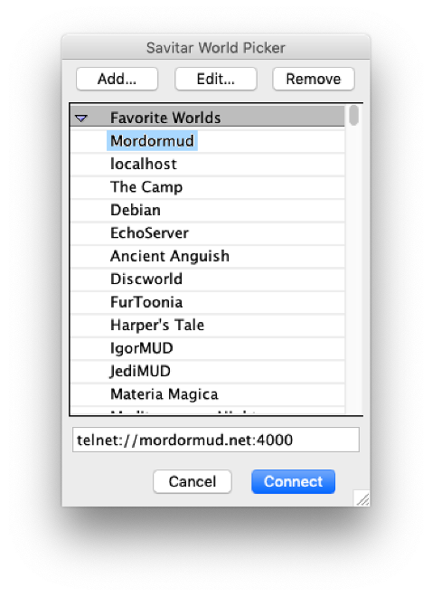

Clicking on “Add…” revealed:

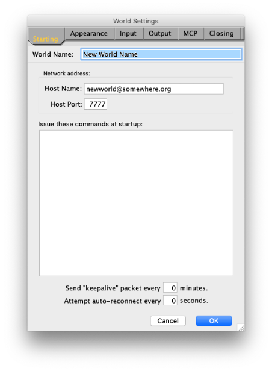

You would fill in the World Name, Host Name, and Host Port values and hit “Okay”. Then the world is added to the list.

Let’s just copy the World Picker for now.

 
## Dec 24th, 2020

I decided that the “Edit…” button isn’t necessary:

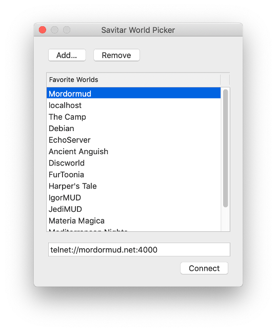
 
and that the “Add…” button brings up a simplified “World Wizard”:

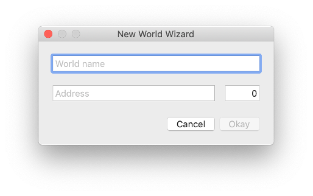

## Dec 27th, 2020

Looking into Input Triggers… styling doesn’t apply when it’s an input only trigger. It can apply on “both”. Thus “gagged” is implied.

Audio is fine. And of course, the big deal is variable capture.
